# F1tenth - 1/10 RC Car with Ackermann Steering

*Development of an Autonomous Navigation System using 2D LiDAR-Based Mapping and Autonomous Driving Control for F1TENTH Racing.*

## 1. Introduction

### Project Overview

This repository contains the full software stack for a comparative study of obstacle avoidance methods on a 1/10 scale F1tenth autonomous racing platform. The study evaluates two map-based controllers against one mapless reactive controller, with two geometric path trackers used as baselines on a clean track. Stanley Avoidance and Lattice Planner with Pure Pursuit form the map-based group. The Follow the Gap Mechanism forms the mapless group. Pure Pursuit and Stanley serve as the geometric baselines. All controllers run on real hardware under ROS 2 Humble, while the steering servo runs under micro-ROS on an STM32G474RE microcontroller.

### Team Members

- นางสาว ดิษย์ธร สุทธาเวศ (66340500019)
- นางสาว บุณยาพร ปรีชาศุทธิ์ (66340500031)
- นาย ภคิน บุญชนะชัย (66340500037)
- นาย ภูริวัฒ เกษมสุขไพศาล (66340500044)
- นาย ณัฏฐ์พัชร์ ลาภสิทธิวงศ์ (66340500077)

The team belongs to the Institute of Field Robotics (FIBO) at King Mongkut's University of Technology Thonburi (KMUTT).

### 1.1 Objectives

- The project studies the localization and mapping (SLAM) system. SLAM Toolbox fuses data from a 2D LiDAR and an IMU so the system can build an environment map and estimate the vehicle pose in real-time with enough accuracy for motion.
- The project develops a motion control system for the autonomous vehicle, where the car either follows a defined path or moves with the surroundings in a stable manner, while it keeps both position error and heading error low.
- The project develops a real-time obstacle avoidance system that uses LiDAR data so the controller can react fast, stay safe, and keep continuous motion.
- The project studies and compares the map-based and map-less approaches. The analysis covers a reactive system such as Follow the Gap against a map-based system that combines SLAM with path planning and a controller, in terms of speed, stability, and obstacle avoidance capability.
- The project develops an integrated autonomous driving pipeline. The end-to-end stack covers sensor acquisition, data processing, motion planning, vehicle control, and real-time visualization and analysis.

### 1.2 Scope

- The system runs on the ROS 2 Humble framework.
- The primary sensors are the RPLIDAR C1 LiDAR and the BNO055 USB-Stick IMU.
- The vehicle is a 1/10 scale RC car with Ackermann steering that follows the F1TENTH standard.
- The mapping and localization stack uses a 2D SLAM algorithm such as SLAM Toolbox.
- The work develops and tests both a map-based system that contains SLAM, raceline generation, planning, and control, together with a map-less reactive system such as Follow the Gap.
- The work develops and tests several obstacle avoidance strategies.
- The motion control runs in real-time through a VESC (Vedder Electronic Speed Controller) or an equivalent control board such as the STM32.
- The tests run in a controlled track environment with random obstacles.
- The system visualizes and analyzes data in real-time through RViz2.
- The work does not cover GPS-based navigation or visual SLAM.

---

## Table of Contents

1. [Introduction](#1-introduction)
2. [Hardware Components and Specification](#2-hardware-components-and-specification)
3. [System Architecture](#3-system-architecture)
4. [Bicycle Kinematic Model](#4-bicycle-kinematic-model)
5. [SLAM and Localization](#5-slam-and-localization)
6. [Raceline Generation](#6-raceline-generation)
7. [Controllers](#7-controllers)
8. [Experimental Results](#8-experimental-results)
9. [Workspace Structure](#9-workspace-structure)
10. [Installation](#10-installation)
11. [Usage](#11-usage)
12. [Conclusion](#12-conclusion)

---

## 2. Hardware Components and Specification

The drivetrain uses a brushless DC motor controlled over the UART protocol through a VESC. The steering servo runs under micro-ROS on an STM32G474RE microcontroller. Two LiPo 4S batteries give an estimated runtime of about 2 hours and 30 minutes.

| # | Component | Image | Specification |
|---|---|---|---|
| 1 | 3665 G3 2400 KV BLDC | 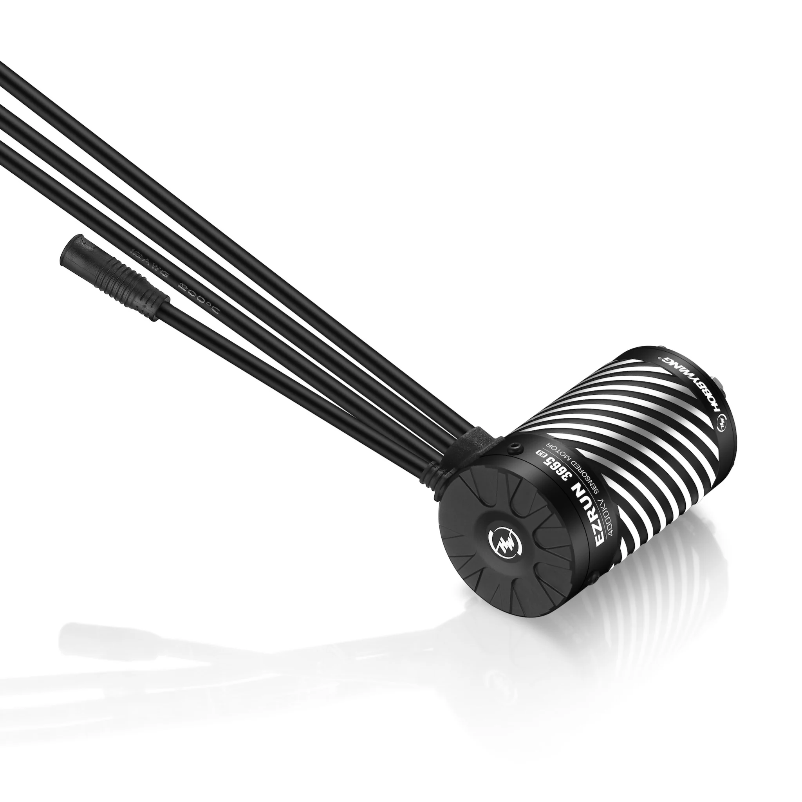 | KV rating is 2400. Can size is 36 by 65 millimeters. Voltage range covers 2S to 4S LiPo. Shaft diameter is 5 millimeters. |
| 2 | RPLIDAR C1 | 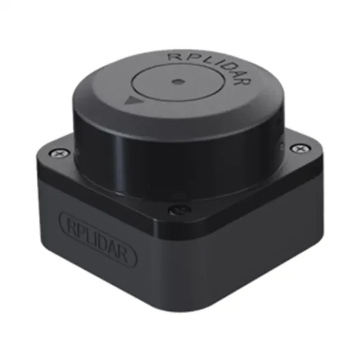 | The sensor is a 2D 360 degree LiDAR scanner. Range reaches up to 12 meters. Scan frequency falls between 5 and 10 hertz. Angular resolution is roughly 0.9 degrees. |
| 3 | BNO055 USB Stick | 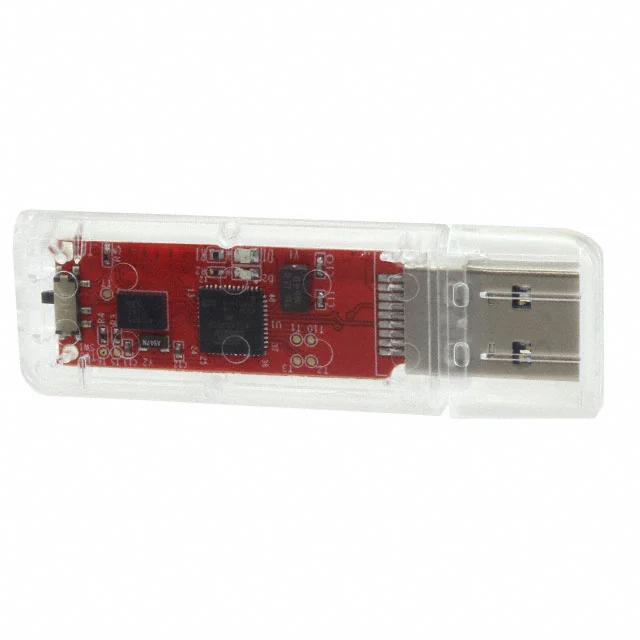 | The sensor type is a 9 degree of freedom absolute orientation IMU. The output contains Euler angles, quaternion, and linear acceleration. |

The car dimensions and mechanical limits appear in the figure below. The gear ratio is 29.5 to 1, and the maximum steering angle satisfies $\delta_{\max} = \pm 24^{\circ}$.

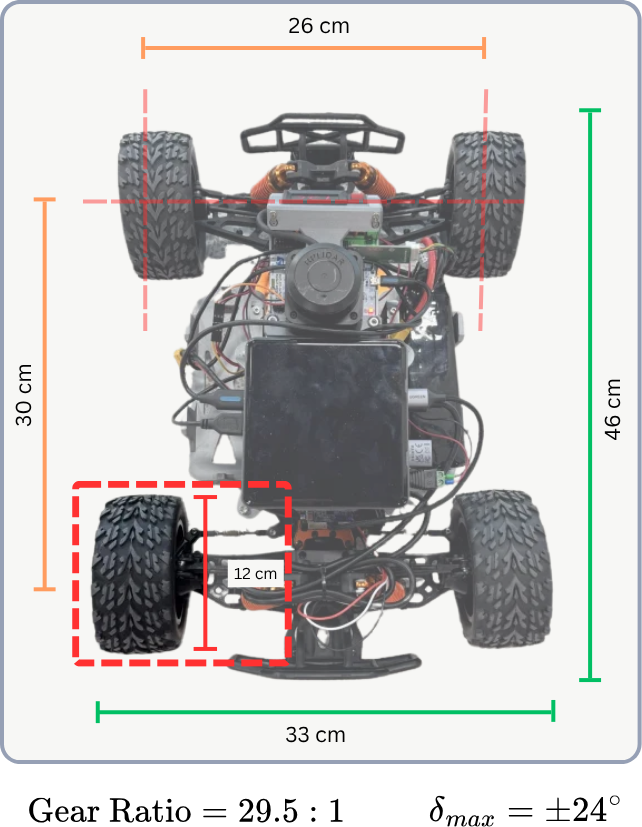

---

## 3. System Architecture

The figure below shows the complete system architecture. Wheel odometry and the BNO055 IMU feed into an EKF from the `robot_localization` package, and SLAM Toolbox runs in Localization Mode against a frozen map. The map-based controllers consume the SLAM corrected pose, while the mapless controller consumes the raw `/scan` topic. A demultiplexer node splits the selected `/drive` command into `/steering_angle` for the STM32 and `/vesc/cmd` for the VESC.

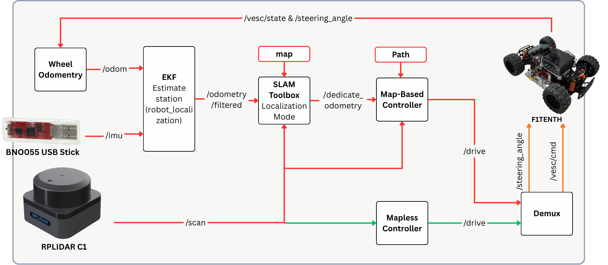

The main topics are listed below.

| Topic | Type | Description |
|---|---|---|
| `/scan` | `sensor_msgs/LaserScan` | LiDAR scan from the RPLIDAR C1. |
| `/imu` | `sensor_msgs/Imu` | Inertial measurement from the BNO055. |
| `/odom` | `nav_msgs/Odometry` | Wheel odometry derived from the VESC. |
| `/odometry/filtered` | `nav_msgs/Odometry` | EKF fused pose. |
| `/dedicate_odometry` | `nav_msgs/Odometry` | SLAM corrected pose used by map-based controllers. |
| `/drive` | `ackermann_msgs/AckermannDriveStamped` | Commanded drive output from a controller. |
| `/vesc/cmd` and `/steering_angle` | mixer outputs | Final commands sent to the VESC and the STM32. |
| `/vesc/state` | `vesc_msgs/VescStateStamped` | Motor state feedback used for wheel odometry. |

---

## 4. Bicycle Kinematic Model

The F1tenth car is approximated by a bicycle model where the two front wheels collapse into one steerable wheel and the two rear wheels collapse into one driven wheel. Together with the no-slip assumption and the Instantaneous Center of Rotation construction, this approximation yields the classical kinematic equations shown below.

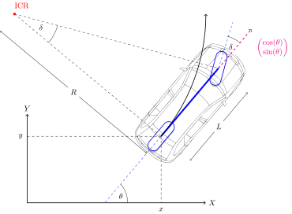

$$
\dot{x} = v\cos(\theta), \qquad
\dot{y} = v\sin(\theta), \qquad
\dot{\theta} = \frac{v\tan(\delta)}{L}
$$

The inverse relation gives the steering angle in terms of the measured yaw rate $\Omega_z$.

$$
\delta = \arctan\!\left(\frac{L\,\Omega_z}{v}\right)
$$

Here $L$ denotes the wheel base and $\delta$ denotes the front wheel steering angle.

---

## 5. SLAM and Localization

The platform uses SLAM Toolbox in Localization Mode against a previously saved pose graph stored under `map/` as `.posegraph`, `.yaml`, and `.pgm` files. The EKF in `robot_localization` fuses wheel odometry from `/odom` and the BNO055 IMU on `/imu` to produce `/odometry/filtered`, which seeds the scan matcher together with the live `/scan` topic. The resulting stable map frame pose is published as `/dedicate_odometry`, and every map-based controller along with the lattice planner consumes this corrected pose.

---

## 6. Raceline Generation

The raceline is computed offline from the saved map by `f1tenth_controller/scripts/raceline_generator.py`. The generator reads the `.yaml` file to recover the resolution, origin, and image path, then it runs the pipeline described below.

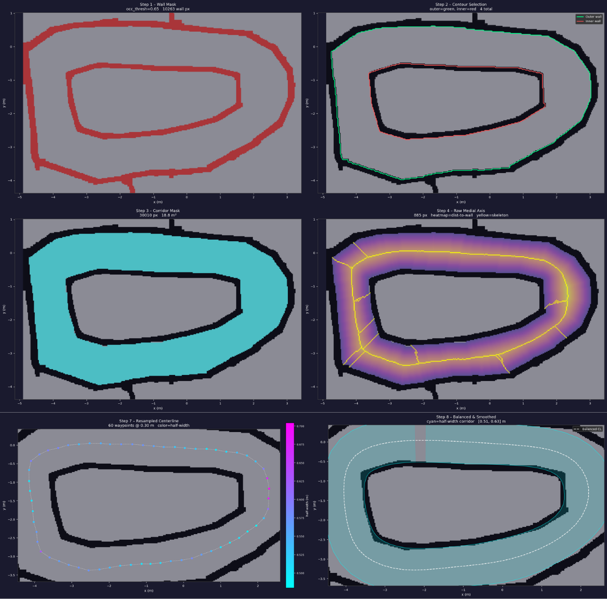

### 6.1 Centerline Extraction in Eight Steps

| Step | Description |
|---|---|
| 1. Wall Mask | The generator thresholds the map image so that pixels darker than `occupied_thresh × 255` are marked as walls. Dark pixels denote obstacles and bright pixels denote free space. |
| 2. Contour Selection | The generator finds all closed contours in the wall mask through a full hierarchy tree, and it auto selects the outer track wall and the inner island wall. |
| 3. Corridor Mask | The driveable area equals the outer fill minus the inner fill minus the wall pixels. The result is a binary mask of the corridor that the car can actually drive through. |
| 4. Raw Medial Axis | The generator runs `skimage.medial_axis` on the corridor. The skeleton is the locus of all points equidistant from both walls. |
| 5. Pruned Skeleton | The generator iteratively removes skeleton pixels that have only one neighbor. |
| 6. Directed Main Loop | The generator builds a graph where skeleton pixels are nodes and adjacency forms edges. It then calls `networkx.cycle_basis` and picks the longest cycle, which becomes the closed track loop with traversal direction preserved. |
| 7. Resampled Centerline | The generator parameterizes the pixel loop by arc length, then it re-interpolates at uniform spacing. |
| 8. Balanced and Smoothed | The generator ray casts perpendicular left and right from each waypoint, then it nudges the waypoint toward the midpoint until $\mathrm{gap}_L \approx \mathrm{gap}_R$. |

### 6.2 Speed Profile

The speed profile applies three passes on top of the smoothed centerline. The lateral limit slows the car in corners and lets it run faster on straights, as given by the equation below.

$$
v_{\text{lat}}[i] = \sqrt{a_{\text{lat}} \,/\, \kappa[i]}
$$

The forward pass caps each speed so the car cannot exceed what is achievable by accelerating from the previous waypoint.

$$
v[i] \;\le\; \sqrt{v[i-1]^2 + 2\,a_{\text{lon}}\,ds}
$$

The backward pass caps each speed so the car can actually brake in time for the next waypoint.

$$
v[i] \;\le\; \sqrt{v[i+1]^2 + 2\,a_{\text{lon}}\,ds}
$$

The final value is then clamped to the interval $[v_{\min}, v_{\max}]$.

---

## 7. Controllers

### 7.1 Overview

The table below summarizes the five controllers studied in this project.

| Category | Controller | Role |
|---|---|---|
| Map-based local planner | Stanley Avoidance | A path tracker with a ramped lateral offset. |
| Map-based local planner | Lattice Planner with Pure Pursuit | A sampled trajectory planner that tracks the precomputed optimal line. |
| Mapless reactive controller | Follow the Gap Mechanism | A reactive controller that steers toward the largest LiDAR gap. |
| Geometric baseline | Pure Pursuit | A simple waypoint tracker used on the clean track only. |
| Geometric baseline | Stanley | A front axle path tracker used on the clean track only. |

### 7.2 Pure Pursuit

Pure Pursuit is a geometric path tracker that computes the steering angle so the vehicle reaches a single look ahead point on the path. From the geometric analysis of the circular arc, the instantaneous curvature follows the equation below.

$$
k = \frac{1}{R} = \frac{2\sin(\alpha)}{LD}
$$

The kinematic bicycle steering command then becomes the expression below, where the dynamic look ahead distance grows with the forward velocity $V_f$.

$$
\delta = \arctan\!\left(\frac{2\sin(\alpha)}{LD}\right)
      = \arctan\!\left(\frac{2\sin(\alpha)}{\min_{LD} + (K \times V_f)}\right)
$$

A small look ahead distance produces aggressive tracking that tends to oscillate, while a large look ahead distance produces smoother behavior that tends to cut corners.

### 7.3 Stanley

Stanley uses the front axle as the reference point. It combines the heading error $\psi$ with the cross-track error $e$, where the cross-track error is the distance from the front axle to the closest point on the path. The steering command appears below.

$$
\delta(t) = k_{\text{heading}}\,\psi(t)
          + \tan^{-1}\!\left(\frac{k_{\text{crosstrack}}\,e(t)}{v_f(t)}\right),
\qquad \delta(t) \in [\delta_{\min}, \delta_{\max}]
$$

The arctangent term naturally softens the cross-track correction at high forward speed.

### 7.4 Follow the Gap Mechanism

The LiDAR preprocessing runs at 10 hertz. Any point closer than 2.5 meters becomes an obstacle, while invalid LiDAR readings are treated as far free space. The planner only uses the front window of plus or minus 120 degrees.

The controller then creates an adaptive safety bubble where closer obstacles produce a larger bubble and farther obstacles produce a smaller one. The physical bubble size converts into a LiDAR index width $B_i$, and the inflated range $p_j$ becomes zero inside the bubble.

$$
B_i = \frac{b(\tilde{r}_i)}{\tilde{r}_i \, \Delta\theta}, \qquad
p_j = \begin{cases} 0, & j \in [i-B_i,\;i+B_i] \\ r_j, & \text{otherwise} \end{cases}
$$

A gap is a continuous sequence of non-zero LiDAR ranges. A value of $p_j = 0$ marks an unsafe direction, and a value of $p_j > 0$ marks a candidate free direction. For each candidate gap $k$ the controller measures the gap width, the gap distance statistics, and the gap center.

$$
W_k = e_k - s_k + 1, \qquad c_k = \frac{s_k + e_k}{2}, \qquad c_0 = \frac{N}{2}
$$

$$
\min_{i \in G_k} p_i, \qquad \frac{1}{W_k}\sum_{i = s_k}^{e_k} p_i, \qquad \max_{i \in G_k} p_i
$$

The score blends openness with closeness to the car center, so the best gap stays open and deep yet not too far from the heading center.

$$
S_{\text{center},k} = 1 - \left(\frac{|c_0 - c_k|}{c_0}\right), \qquad
S_k = 0.4\,d_{\max,k} + 0.6\,d_{\text{avg},k} \times S_{\text{center},k}
$$

$$
k^{*} = \arg\max_{k} S_k
$$

The robot drives toward the center of the best gap according to the heading selection below.

$$
c^{*} = \frac{s^{*} + e^{*}}{2}, \qquad \theta^{*} = \theta_{\min} + c^{*}\Delta\theta
$$

The clearance is the minimum free distance around the chosen heading, where the inspection window $\mathcal{W}(\theta^{*})$ depends on the turning direction. The window spans $[\theta^{*}, \theta^{*}+45^{\circ}]$ when the robot turns right, $[\theta^{*}-45^{\circ}, \theta^{*}]$ when it turns left, and $[\theta^{*}-30^{\circ}, \theta^{*}+30^{\circ}]$ when it goes mostly straight.

$$
D_{\text{clear}} = \min_{i \in \mathcal{W}(\theta^{*})} p_i
$$

The raw speed depends on the clearance, and the controller then applies a sharp turn penalty to slow the car when the steering angle grows.

$$
v_{\text{raw}} = \begin{cases}
v_{\min}, & D_{\text{clear}} < 1.5 \\
v_{\max}, & D_{\text{clear}} > 4.0 \\
K_p\,D_{\text{clear}}, & \text{otherwise}
\end{cases}
\qquad
v = \mathrm{clip}\!\left(v_{\text{raw}}\,(0.4 + 0.6\cos|\theta^{*}|),\; v_{\min},\, v_{\max}\right)
$$

A large clearance with a small steering angle produces higher speed. A small clearance with a sharp turn produces slower speed.

The steering command is smoothed to avoid sudden jumps, and a speed dependent gain $f_v$ reduces the steering authority when the car is fast.

$$
\alpha_{\text{des}} = \mathrm{clip}(\theta^{*}, -\alpha_{\max}, \alpha_{\max}), \qquad
\alpha_{\text{smooth}} = \lambda\,\alpha_{\text{des}} + (1-\lambda)\,\alpha_{\text{prev}}
$$

$$
f_v = 1 - 0.5\left(\frac{v - v_{\min}}{v_{\max} - v_{\min}}\right), \qquad
\alpha_{\text{cmd}} = f_v\,\alpha_{\text{smooth}}
$$

### 7.5 Stanley Avoidance

The proposed map-based controller performs obstacle avoidance while it still relies on the Stanley controller for path tracking. When an obstacle is detected, the controller adds a temporary lateral offset to the Stanley cross-track error.

In Step 1 the controller converts each LiDAR point to Cartesian space and rasterizes it onto a 2D occupancy grid through the equation below.

$$
(i,j) = \left(-xC + H,\; yC + \frac{W}{2}\right), \qquad x = r\cos\theta,\; y = r\sin\theta
$$

In Step 2 the controller inflates the path for collision checking, where the inflation radius equals the vehicle radius plus a safety margin. A collision exists if any occupied cell falls inside the inflated tube around the path segment.

$$
r_{\text{inflate}} = r_{\text{vehicle}} + r_{\text{safety}}, \qquad
\text{Collision} = \exists\, c \in (\text{PathSegment} \oplus r_{\text{inflate}}) : \text{Occ}(c) = 1
$$

In Step 3 the controller determines the side of the path on which the obstacle lies, and then it computes the target offset magnitude from the perpendicular distance $d_\perp$.

$$
s = \mathrm{sign}\!\left((\mathbf{p}_{\text{next}} - \mathbf{p}_{\text{prev}}) \times (\mathbf{p}_{\text{obs}} - \mathbf{p}_{\text{prev}})\right)
$$

$$
e_{\text{target}} = -s \cdot \mathrm{clip}\!\left(d_\perp + r_{\text{vehicle}} + r_{\text{safety}},\; e_{\min},\, e_{\max}\right)
$$

In Step 4 the controller ramps the applied offset $e_{\text{offset}}$ toward the target with a maximum step $r$, and it resets the target to zero once the obstacle passes behind the car.

$$
\Delta e = e_{\text{target}} - e_{\text{offset}}(k), \qquad
e_{\text{offset}}(k+1) = \begin{cases}
e_{\text{target}}, & |\Delta e| \le r \\
e_{\text{offset}}(k) + \mathrm{sign}(\Delta e)\cdot r, & \text{otherwise}
\end{cases}
$$

$$
e_{\text{target}} = 0 \quad \text{if } p^{c}_{\text{obs},x} < \tau_{\text{pass}}
$$

The augmented Stanley control law then injects the ramped offset into the cross-track term.

$$
\delta(t) = k_{\text{heading}}\,\psi(t)
          + \tan^{-1}\!\left(\frac{k_{\text{crosstrack}}\,\big(e(t) + e_{\text{offset}}(t)\big)}{v_f(t)}\right)
$$

### 7.6 Lattice Planner with Pure Pursuit

In the sense stage the planner filters LiDAR points to a window of plus or minus 135 degrees that covers the front and the sides. Each point transforms from the car frame to the world frame, and then it splits into two groups. Points that fall within `track_half_width` of the raceline become obstacles that the car must avoid. Points that fall beyond that but within an extra 1.5 meters become walls that mark the track boundary. Points behind that range are ignored entirely because they are not on the track.

In the plan stage the planner generates candidate paths by shifting the entire window left or right along the perpendicular normals, with nine offset levels. The planner scores each candidate through the cost expression below.

```
score = w_deviation  * |offset|                  prefer staying near the raceline
      + 0.3          * curvature_cost            prefer smooth paths
      + 25.0         * max(0, 0.8 - surplus)^2   heavy penalty near obstacles
      + 15.0         * wall_shortfall^2          penalty for clipping walls
      + w_continuity * |offset - prev_offset|    prefer not changing sides
```

Any candidate that falls within `safety_radius` of an obstacle or wall is hard rejected before scoring.

A small state machine controls when to avoid. In the FOLLOWING state the planner checks whether the centerline itself is blocked, and if so it evaluates all candidates and locks onto the best offset. In the AVOIDING state the planner keeps the committed path, and it re-plans only after `replan_hold_ticks` to prevent oscillation. The planner returns to the centerline only when both the committed path and the centerline stay clear for `clear_hold_ticks` consecutive ticks.

The control stage applies Pure Pursuit on the selected path. The adaptive look ahead equals the product of speed and gain, and it is clamped to the interval from 0.8 to 1.5 meters. The planner finds the target point and computes the steering command through the bicycle model expression $\delta = \arctan(L \cdot 2y / L_d^{2})$.

---

## 8. Experimental Results

### 8.1 Field Setup

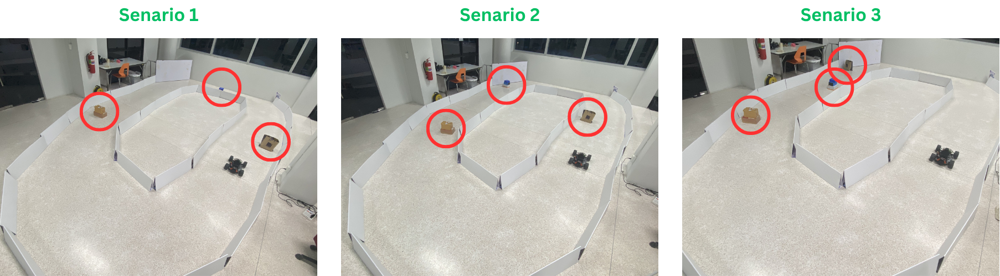

The racetrack width ranges from 120 to 160 centimeters. The obstacle dimensions stay within 26 by 18 by 30 centimeters. Every controller is evaluated under identical track and speed conditions, and each one runs with its own best performing tuning. Four conditions are tested in total, which include the clean track and three obstacle arrangements labeled Scenario 1, Scenario 2, and Scenario 3.

### 8.2 Experiment 1, Localization Accuracy

The purpose of this experiment is to verify that SLAM Toolbox Localization Mode produces a stable and non-diverging pose across all operating conditions. The setup uses a frozen map, all controllers run, four conditions are tested per controller, and every trial starts from the same pose.

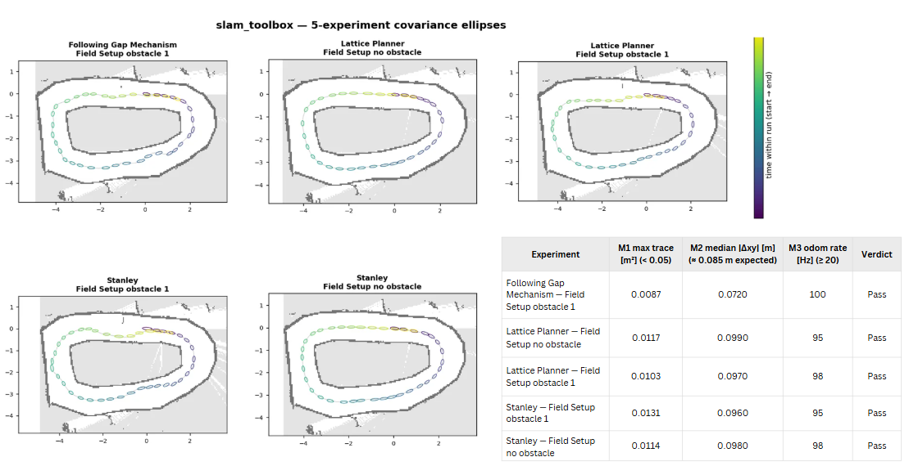

| Experiment | M1 max trace [m²] (target below 0.05) | M2 median \|Δxy\| [m] (about 0.085 expected) | M3 odom rate [Hz] (target at least 20) | Verdict |
|---|---:|---:|---:|:---:|
| Follow the Gap on obstacle 1 | 0.0087 | 0.0720 | 100 | Pass |
| Lattice on no obstacle | 0.0117 | 0.0990 | 95 | Pass |
| Lattice on obstacle 1 | 0.0103 | 0.0970 | 98 | Pass |
| Stanley on obstacle 1 | 0.0131 | 0.0960 | 95 | Pass |
| Stanley on no obstacle | 0.0114 | 0.0980 | 98 | Pass |

Every trial passes. The covariance trace stays far below the 0.05 m² threshold, and the scan match update rate stays at or above 95 hertz.

### 8.3 Experiment 2, Path Tracker Comparison on the Clean Track

The purpose of this experiment is to compare Pure Pursuit, Stanley, and Follow the Gap Mechanism on the precomputed raceline without any obstacles. The setup uses a frozen map, Localization Mode active, the same start pose every trial, and a single fixed speed regime. The trajectory animation appears below as a GIF.

<table>
<tr>
<td>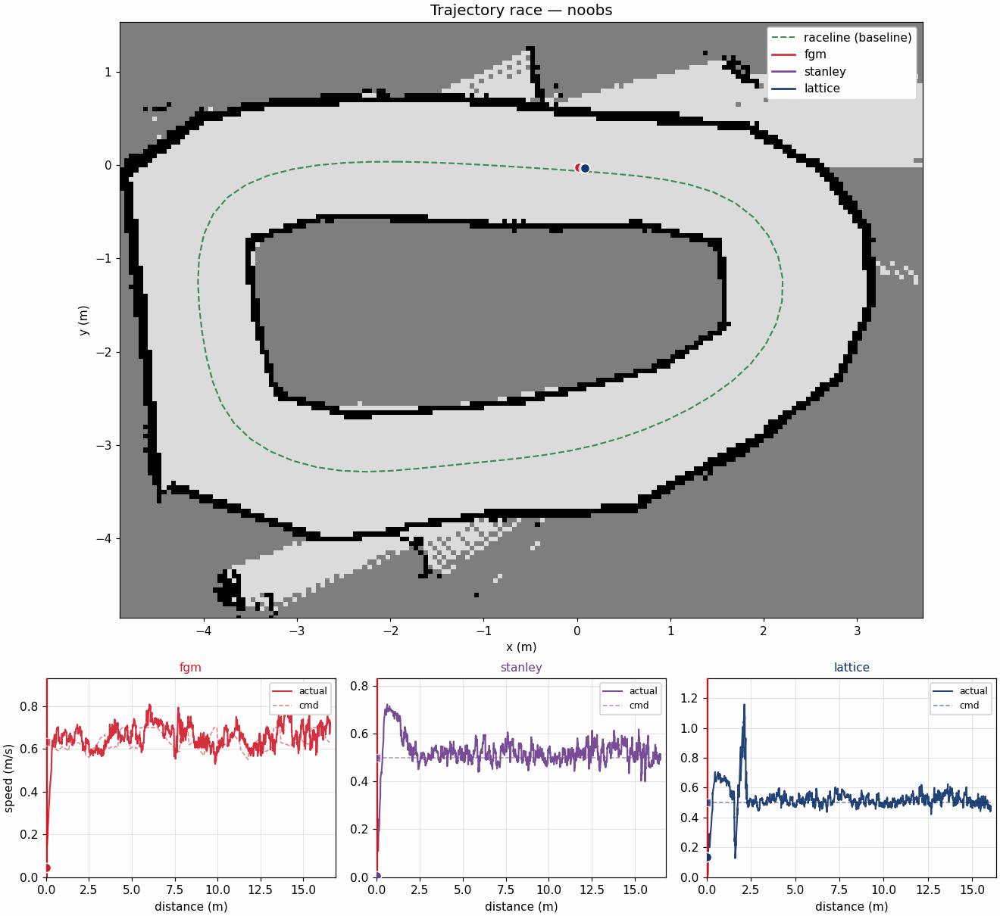</td>
<td>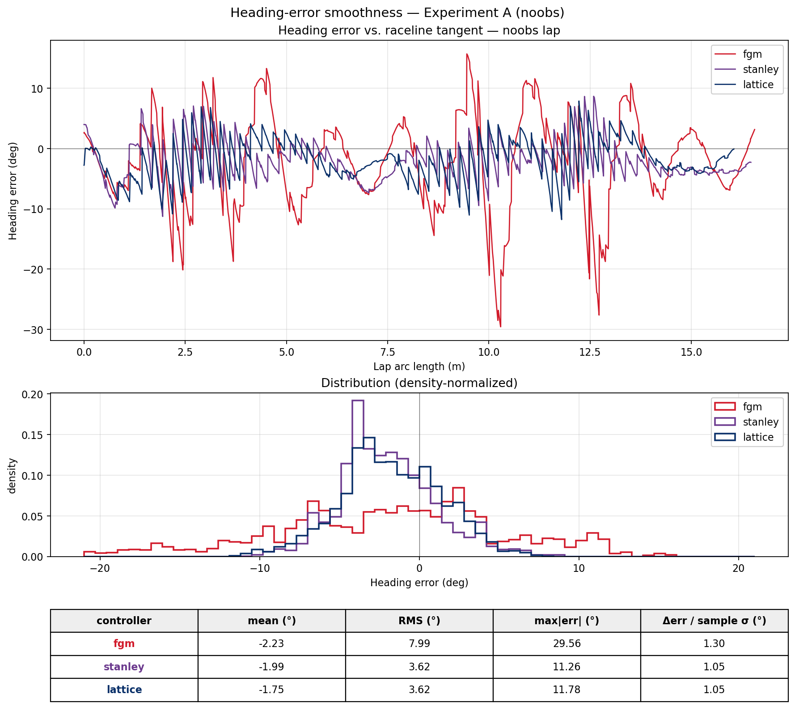</td>
</tr>
</table>

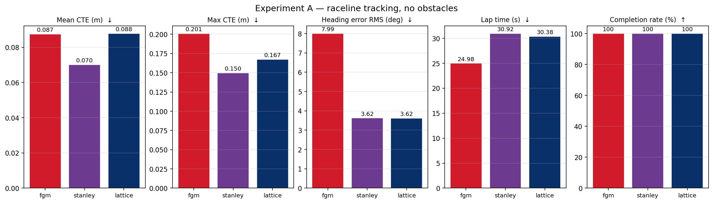

The summary metrics on the clean track appear below.

| Controller | Mean CTE [m] ↓ | Max CTE [m] ↓ | Heading err RMS [°] ↓ | Lap time [s] ↓ | Completion [%] ↑ |
|---|---:|---:|---:|---:|---:|
| Follow the Gap | 0.087 | 0.201 | 7.99 | **24.98** | 100 |
| Stanley | **0.070** | **0.150** | **3.62** | 30.92 | 100 |
| Lattice | 0.088 | 0.167 | 3.62 | 30.38 | 100 |

Stanley and Lattice tie on heading error RMS at 3.62 degrees. Follow the Gap finishes fastest, but it pays for that speed with much worse heading smoothness.

The heading error distribution, normalized by density, gives the values below.

| Controller | Mean [°] | RMS [°] | max\|err\| [°] | Δerr / sample σ [°] |
|---|---:|---:|---:|---:|
| Follow the Gap | -2.23 | 7.99 | 29.56 | 1.30 |
| Stanley | -1.99 | 3.62 | 11.26 | 1.05 |
| Lattice | -1.75 | 3.62 | 11.78 | 1.05 |

### 8.4 Experiment 3, Static Obstacle Avoidance

The purpose of this experiment is to compare the mapless approach against the two map-based approaches when the obstacles are not present in the saved map. The setup uses three obstacle layouts with the same dimensions across all controllers, a frozen map, Localization Mode active, and the same start pose every trial. The trajectory animations per scenario appear below as GIFs.

<table>
<tr>
<td align="center"><b>Scenario 1</b></td>
<td align="center"><b>Scenario 2</b></td>
<td align="center"><b>Scenario 3</b></td>
</tr>
<tr>
<td>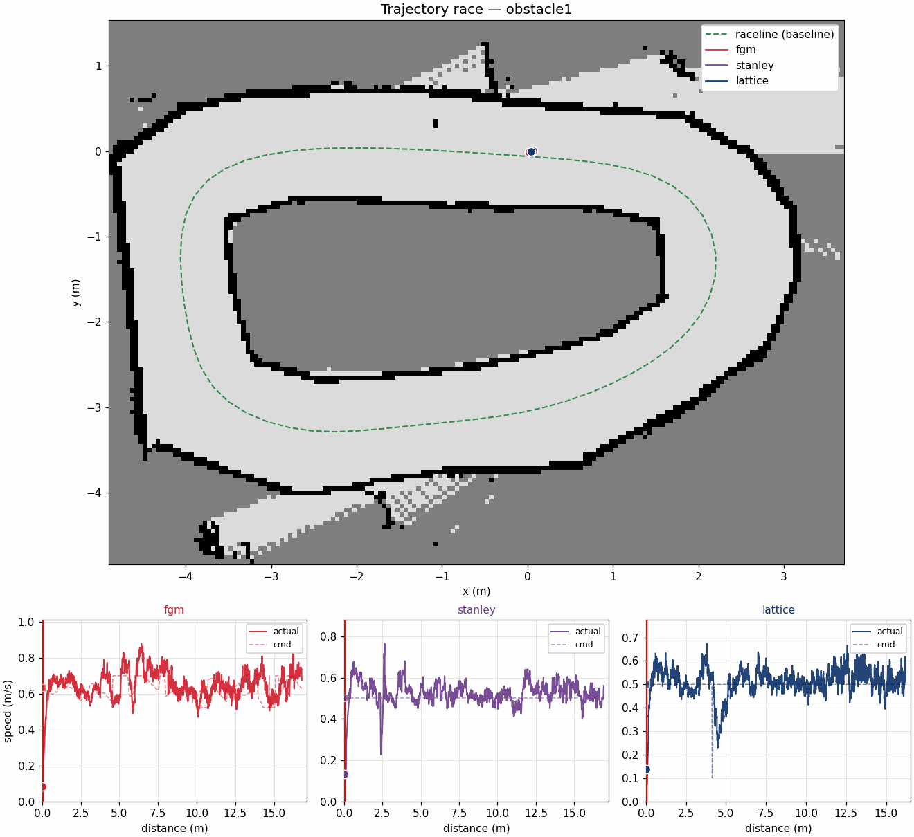</td>
<td>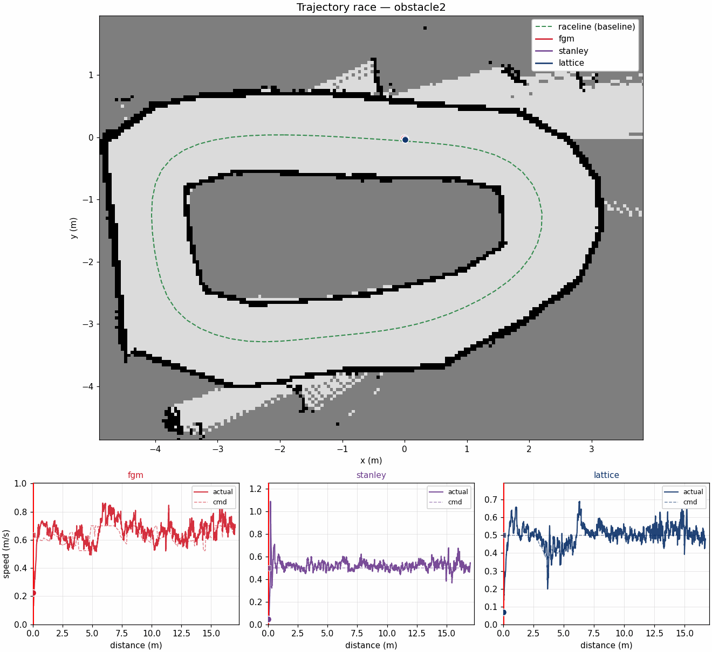</td>
<td>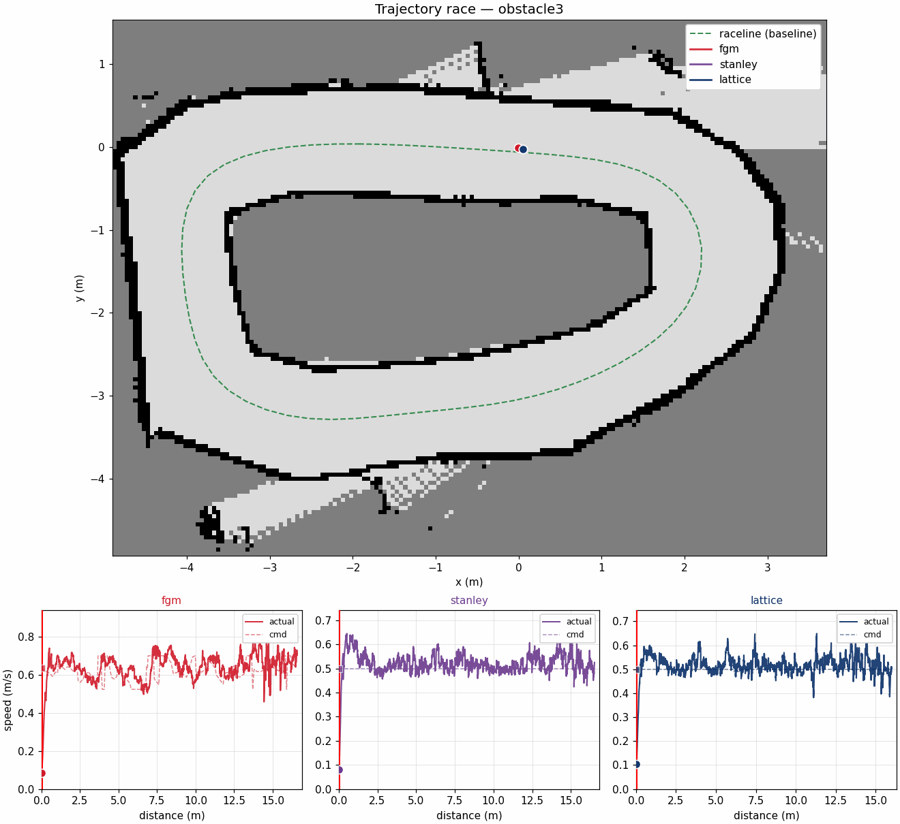</td>
</tr>
</table>

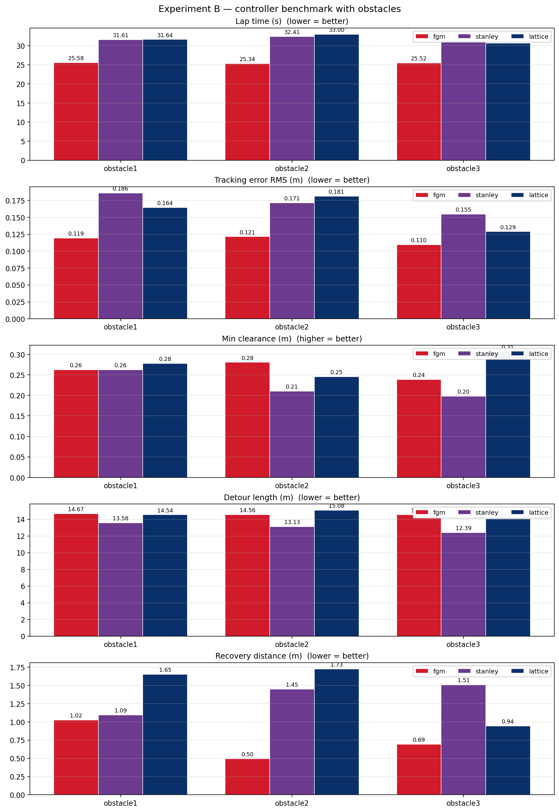

The lap time results in seconds, where a lower value is better, appear below.

| Scenario | Follow the Gap | Stanley Avoidance | Lattice with PP |
|---|---:|---:|---:|
| Obstacle 1 | **25.58** | 31.61 | 31.64 |
| Obstacle 2 | **23.34** | 32.41 | 30.30 |
| Obstacle 3 | 25.59 | n/a | n/a |

The tracking error RMS results in meters, where a lower value is better, appear below.

| Scenario | Follow the Gap | Stanley Avoidance | Lattice with PP |
|---|---:|---:|---:|
| Obstacle 1 | **0.119** | 0.186 | 0.164 |
| Obstacle 2 | **0.121** | 0.171 | 0.183 |
| Obstacle 3 | **0.110** | 0.155 | 0.129 |

The minimum clearance results in meters, where a higher value is better, appear below.

| Scenario | Follow the Gap | Stanley Avoidance | Lattice with PP |
|---|---:|---:|---:|
| Obstacle 1 | 0.26 | 0.26 | **0.28** |
| Obstacle 2 | **0.25** | 0.21 | **0.25** |
| Obstacle 3 | **0.24** | 0.20 | n/a |

The detour length results in meters, where a lower value is better, appear below.

| Scenario | Follow the Gap | Stanley Avoidance | Lattice with PP |
|---|---:|---:|---:|
| Obstacle 1 | 14.67 | **13.58** | 14.34 |
| Obstacle 2 | 14.58 | **13.12** | 13.30 |
| Obstacle 3 | n/a | **12.35** | n/a |

The recovery distance results in meters, where a lower value is better, appear below.

| Scenario | Follow the Gap | Stanley Avoidance | Lattice with PP |
|---|---:|---:|---:|
| Obstacle 1 | **1.02** | 1.09 | 1.65 |
| Obstacle 2 | **0.50** | 1.45 | 1.75 |
| Obstacle 3 | 0.69 | 1.51 | **0.94** |

The heading error smoothness plots per scenario appear below.

<table>
<tr>
<td>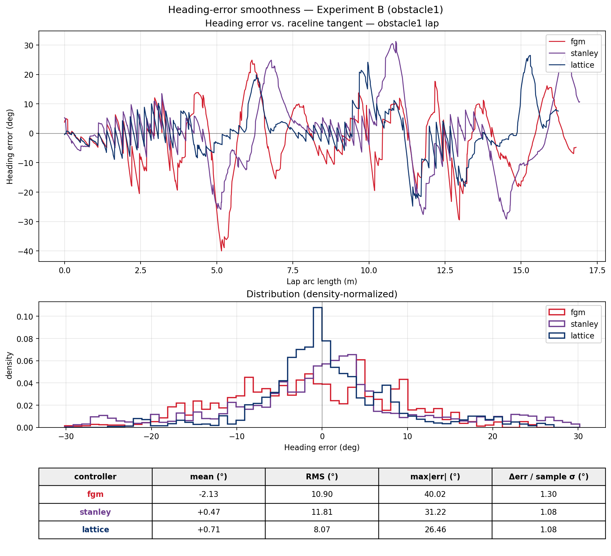</td>
<td>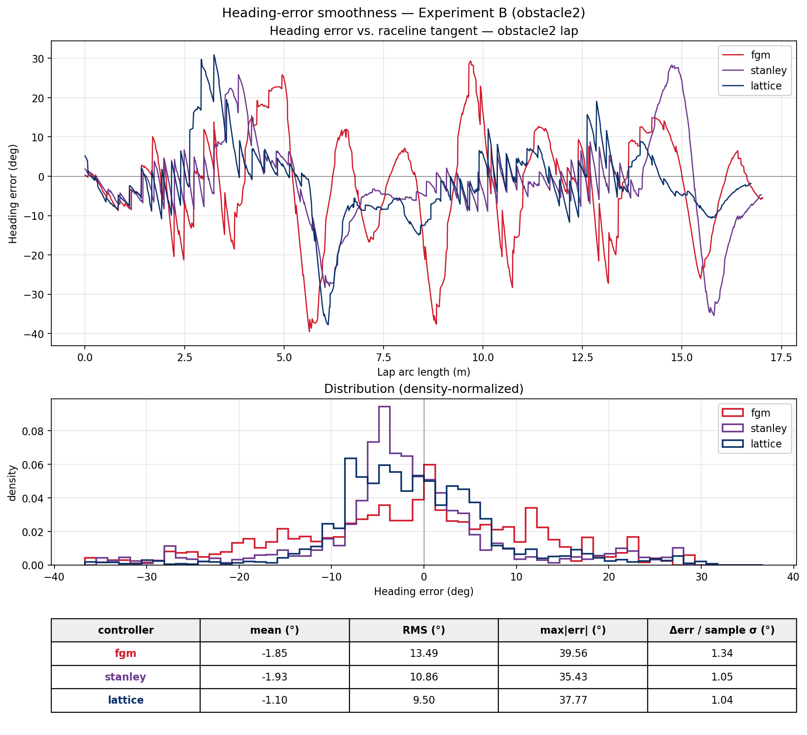</td>
<td>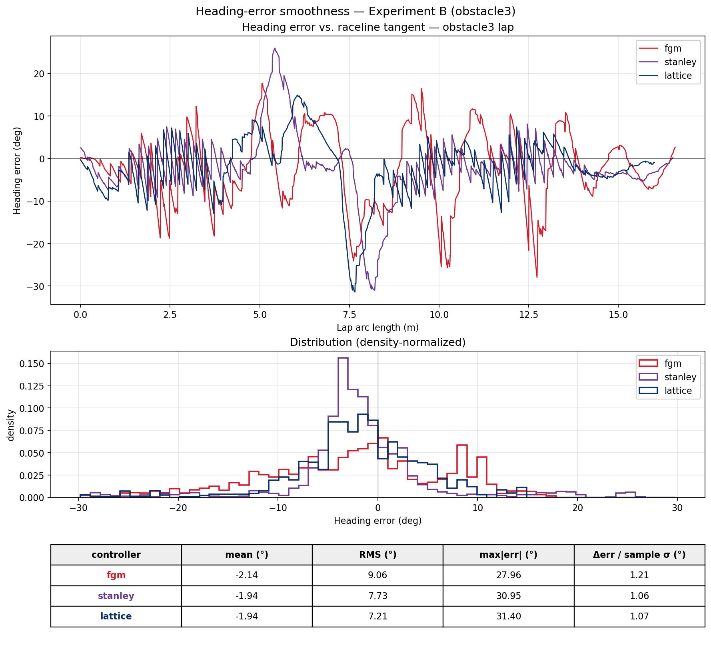</td>
</tr>
</table>

The heading error distribution per scenario gives the values below.

| Scenario | Controller | Mean [°] | RMS [°] | max\|err\| [°] | Δerr σ [°] |
|---|---|---:|---:|---:|---:|
| Obstacle 1 | Follow the Gap | -2.13 | 10.90 | 40.02 | 1.30 |
| Obstacle 1 | Stanley | +0.47 | 11.81 | 31.22 | 1.08 |
| Obstacle 1 | Lattice | +0.71 | **8.07** | **26.46** | 1.08 |
| Obstacle 2 | Follow the Gap | -1.85 | 13.49 | 39.56 | 1.34 |
| Obstacle 2 | Stanley | -1.93 | 10.86 | **35.43** | 1.05 |
| Obstacle 2 | Lattice | -1.10 | **9.50** | 37.77 | 1.04 |
| Obstacle 3 | Follow the Gap | -2.14 | 9.06 | **27.96** | 1.21 |
| Obstacle 3 | Stanley | -1.94 | 7.73 | 30.95 | 1.06 |
| Obstacle 3 | Lattice | -1.94 | **7.21** | 31.40 | 1.07 |

---

## 9. Workspace Structure

```
carver_f1tenth/
├── analysis/               Result plots, GIFs, and metric CSVs from the experiments above
├── figure/                 Hardware photos and schematic figures used by this README
├── firmware/               STM32G474RE steering node built with micro-ROS in STM32CubeIDE
│   └── steering_node/      Core, Drivers, micro_ros_stm32cubemx_utils
├── map/                    SLAM maps as .pgm, .yaml, and .posegraph triples
├── record/                 rosbag2 recordings organized one folder per controller and scenario
│   ├── fgm_{noobs,obstacle1,obstacle2,obstacle3}/
│   ├── lattice_{noobs,obstacle1,obstacle2,obstacle3}/
│   └── stanley_{noobs,obstacle1,obstacle2,obstacle3}/
├── ros2_ws/                Main ROS 2 Humble workspace
│   └── src/
│       ├── f1tenth_bringup/        Launch files for sensor, actuator, base_loc, controller, joystick
│       ├── f1tenth_controller/     Controller nodes, raceline generator, and precomputed paths
│       │   ├── scripts/            stanley_avoidance.py, gap_follow.py, lattice_planner.py,
│       │   │                       pure_pursuit.py, raceline_generator.py
│       │   └── path/               Precomputed raceline YAML files and previews
│       ├── f1tenth_description/    URDF, meshes, and RViz config
│       ├── f1tenth_gym/            f1tenth_gym Python package from upstream
│       ├── f1tenth_gym_ros/        ROS 2 wrapper around f1tenth_gym with Spielberg maps
│       ├── f1tenth_joy/            Joystick teleop node
│       ├── f1tenth_mixer/          Demultiplexer that maps /drive into /steering_angle and /vesc/cmd
│       ├── f1tenth_urdf/           Simplified URDF
│       ├── f1tenth_vesc_driver/    VESC UART driver
│       └── f1tenth_viz/            RViz visualization helpers
├── sensor_ws/              Sensor drivers workspace
│   └── src/
│       ├── bno055_usb_stick/       9 degree of freedom IMU driver
│       └── rplidar_ros/            RPLIDAR C1 ROS 2 driver
├── slam_ws/                SLAM workspace
│   └── src/f1tenth_slam/   SLAM Toolbox config, launch, and RViz
├── tools/                  launcher.py and log_trajectory.py for the offline logger
├── slide.pdf               Final presentation that drives the content of this README
└── README.md
```

---

## 10. Installation

### 10.1 System Dependencies

The system packages below are installed through apt.

```bash
sudo apt update
sudo apt install -y git build-essential python3-dev python3-pip \
    libgl1-mesa-dev libglu1-mesa-dev libeigen3-dev fontconfig libfreetype6-dev tmux \
    gcc-arm-none-eabi docker.io
```

The platform also needs ROS 2 Humble desktop, plus the `slam_toolbox`, `robot_localization`, and `ackermann_msgs` ROS packages, and the `micro-ros-agent` binary.

### 10.2 Python Dependencies

The Python packages below are installed through pip.

```bash
pip3 install --upgrade pip
pip3 install bno055-usb-stick-py PyOpenGL PyOpenGL_accelerate transforms3d
pip3 install -e ros2_ws/src/f1tenth_gym
```

### 10.3 Build the Workspaces

The three workspaces are built in sequence as shown below.

```bash
source /opt/ros/humble/setup.bash

cd ros2_ws
colcon build --packages-ignore f110_gym f1tenth_gym_ros
source install/setup.bash

cd ../sensor_ws
colcon build
source install/setup.bash

cd ../slam_ws
colcon build
source install/setup.bash
```

### 10.4 Firmware on the STM32

The firmware project is opened in STM32CubeIDE under `firmware/steering_node`, then it is built and flashed onto the STM32G474RE board. The board exposes itself as `/dev/STM32` at 115200 8N1 baud to the `micro_ros_agent` that `actuator.launch.py` starts.

---

## 11. Usage

Every controller follows the same pattern. The operator first brings up whatever the controller needs, and then the operator launches the controller node itself. In all examples below `<map_basename>` should be replaced with one of the basenames inside `map/` such as `my_map`, `Nine`, `beam`, `bananamap`, or `new_map`.

### 11.1 Follow the Gap (Mapless, No Localization Required)

```bash
# Terminal 1, sensors that include the RPLIDAR and the BNO055 IMU
ros2 launch f1tenth_bringup sensor.launch.py

# Terminal 2, actuators that include the VESC and the micro-ROS agent for the STM32 steering
ros2 launch f1tenth_bringup actuator.launch.py

# Terminal 3, controller node
ros2 run f1tenth_controller gap_follow.py
```

### 11.2 Stanley Avoidance (Map-based)

```bash
# Terminal 1, sensors
ros2 launch f1tenth_bringup sensor.launch.py

# Terminal 2, localization and actuators that share the same launch file
ros2 launch f1tenth_bringup base_loc.launch.py \
    map_file_name:=/home/carver/carver_f1tenth/map/<map_basename>

# Terminal 3, controller node
ros2 run f1tenth_controller stanley_avoidance.py
```

### 11.3 Lattice Planner with Pure Pursuit (Map-based)

```bash
# Terminal 1, sensors
ros2 launch f1tenth_bringup sensor.launch.py

# Terminal 2, localization and actuators
ros2 launch f1tenth_bringup base_loc.launch.py \
    map_file_name:=/home/carver/carver_f1tenth/map/<map_basename>

# Terminal 3, controller node
ros2 run f1tenth_controller lattice_planner.py
```

### 11.4 Pure Pursuit (Baseline, Clean Track Only)

```bash
ros2 launch f1tenth_bringup sensor.launch.py
ros2 launch f1tenth_bringup base_loc.launch.py \
    map_file_name:=/home/carver/carver_f1tenth/map/<map_basename>
ros2 run f1tenth_controller pure_pursuit.py
```

### 11.5 Manual Drive with the Joystick

```bash
ros2 launch f1tenth_bringup sensor.launch.py
ros2 launch f1tenth_bringup actuator.launch.py
ros2 launch f1tenth_bringup joystick.launch.py
```

### 11.6 Generate a New Raceline

```bash
python3 -m f1tenth_controller.raceline_generator \
    --map  /home/carver/carver_f1tenth/map/<map_basename>.yaml \
    --out  ros2_ws/src/f1tenth_controller/path/path_v.yaml \
    --lane mincurv --vmax 4.0 --alat 4.0
```

The lane argument accepts `centerline`, `mincurv` for the minimum curvature racing line which is the fastest, `inner`, and `outer`. The `--vmax` argument sets the maximum velocity in meters per second, and the `--alat` argument sets the maximum lateral acceleration in meters per second squared. The speed profile uses both values.

---

## 12. Conclusion

The experiments support several findings on the F1tenth platform. SLAM Toolbox Localization Mode stays stable under every controller and every obstacle layout, with all five trials in Experiment 1 passing the covariance and update rate thresholds. On the clean track in Experiment 2, Stanley and Lattice tie at the best heading error RMS of 3.62 degrees, while Follow the Gap finishes the lap fastest but with a heading error RMS of 7.99 degrees that is more than twice as large. In Experiment 3 the mapless Follow the Gap Mechanism produces the lowest tracking error RMS in every scenario and the shortest recovery distance in two scenarios out of three, while the map-based Lattice Planner records the lowest heading error RMS in two scenarios and the best minimum clearance in Scenario 1, and Stanley Avoidance produces the shortest detour length in every scenario. Taken together, the mapless approach favors raw speed and short recovery, the Lattice approach favors smooth heading and clearance, and Stanley Avoidance favors short detours. The platform therefore serves as a working testbed where future work can extend the controllers toward dynamic obstacles, higher speed regimes, and learning based policies.
